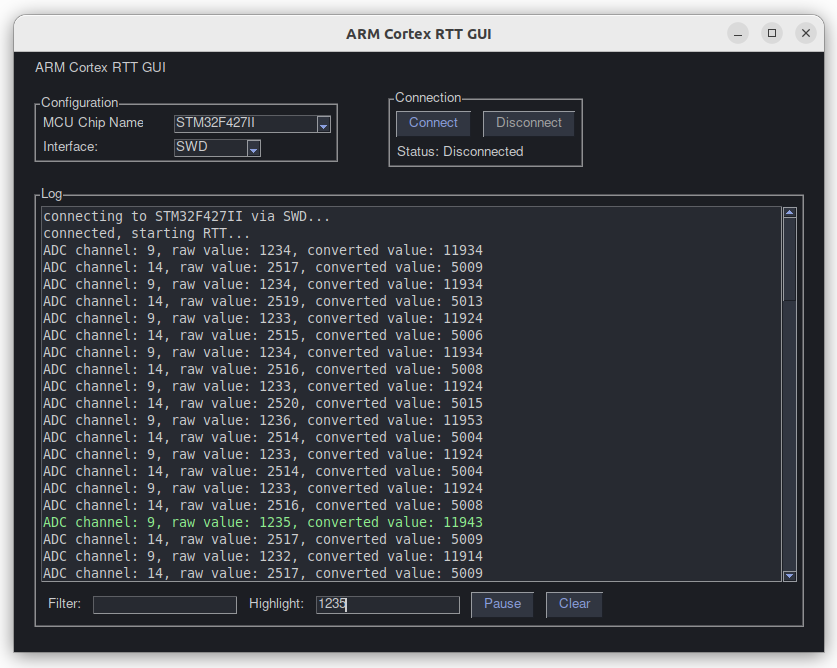

# RTT ARM Cortex SWD/JTAG Logging GUI



## Overview

This project provides a Python-based GUI to display, filter and highlight real-time ARM Cortex microcontroller log messages
received via SEGGER's Real-Time Transfer (RTT) debug protocol.

This debug protocol provides direct communication with ARM Cortex-based microcontrollers via J-Link debug probes.
RTT removes the need for additional debug channels (like UART) by using the ARM Cortex SWD/JTAG interface.
Unlike the slow and clunky UART debug channel the SWD, JTAG interface provides lean and mean debugging for ARM MCUs.

This project interfaces directly with J-Link probe drivers using Segger's Python wrapper `pylink`
to receive RTT messages. It does not require any other intermediary software.

The official documentation and examples for pylink, SEGGER's Python wrapper,
are severely lacking when it comes to using the RTT channel,
so this project may also serve as a practical guide for leveraging `pylink` for RTT communication.

Since messages are processed directly in Python,
it will be possible, without too much effort, to implement many other new debug features like
data plotting and analysis - also capabilities that are not available in SEGGER's RTT applications.

## Table of Contents
- [ARM Cortex RTT SWD/JTAG Logging GUI](#arm-cortex-swd/jtag-logging-gui)
  - [Key Features](#key-features)
  - [Prerequisites](#prerequisites)
    - [Host Software](#host-software)
    - [Embedded Target Setup](#embedded-target-setup)
  - [GUI Installation](#gui-installation)
  - [Usage](#usage)
    - [Start Logging](#start-logging)
    - [Highlight Logs](#highlight-logs)
    - [Filter Logs](#filter-logs)
    - [Disconnect From MCU](#disconnect-from-mcu)
    - [Clear the Log View](#clear-the-log-view)
  - [License](#license)
  - [Contact](#contact)


## Key Features
- Direct J-Link connection using native drivers (no RTTViewer required)
- Real-time display of debug communication
- Log filtering and message highlighting
- Broad MCU support through intuitive selection interface
- Connection status monitoring and management
- Extensible architecture for custom processing (plotting, analysis, etc.)

## Prerequisites

### Host Software
- Python 3.8+ (https://www.python.org/)
- SEGGER J-Link Software ([Download](https://www.segger.com/downloads/jlink))
- Required Python packages (Defined in requirements.txt file):
  - FreeSimpleGUI
  - pylink (Segger's J-Link Python wrapper)

### Embedded Target Setup
Include the SEGGER RTT library files in your embedded app.
See: https://www.segger.com/products/debug-probes/j-link/technology/about-real-time-transfer/

Include RTT in your firmware by using the source code from `JLink/Samples/RTT` included in J-Link installation.
```c
#include "SEGGER_RTT.h"

void main() {
    SEGGER_RTT_Init();
    SEGGER_RTT_SetTerminal(0);
    SEGGER_RTT_printf(0, "System started\n");
}
```

## GUI Installation

1. Clone the repository:
   ```bash
   https://github.com/SaturnIC/RTT-ARM-Cortex-GUI.git
   cd RTT-ARM-Cortex-GUI
   ```
2. Install the required packages:
   ```bash
   pip install -r requirements.txt

   # or explicitly
   pip install FreeSimpleGUI==5.0.0 pylink
   ```
3. Ensure that the J-Link drivers are installed and accessible on your system.

## Usage

### Start Logging
1. Launch the application:
   ```bash
   python rtt_python_gui.py
   ```

2. Select your target MCU from the dropdown list.
   Filter MCU list by typing a matching substring in the MCU dropdown widget.

3. Click "Connect" to establish a connection.

### Highlight Logs
Enter text in highlight box to highlight matching messages

### Filter Logs
Filter log messages by entering a filter substring in the filter box

### Disconnect From MCU
Use the "Disconnect" button to terminate the connection.

### Clear the Log View
Use the "Clear" button to reset the log display.


## License
This project is licensed under the Apache License, Version 2.0. See [LICENSE](LICENSE) for more details.

## Contact
For questions, issues, or contributions, please contact the maintainer

---

**Note:** Requires properly installed J-Link drivers. The application communicates directly with debug hardware using SEGGER's `pylink` Python wrapper.