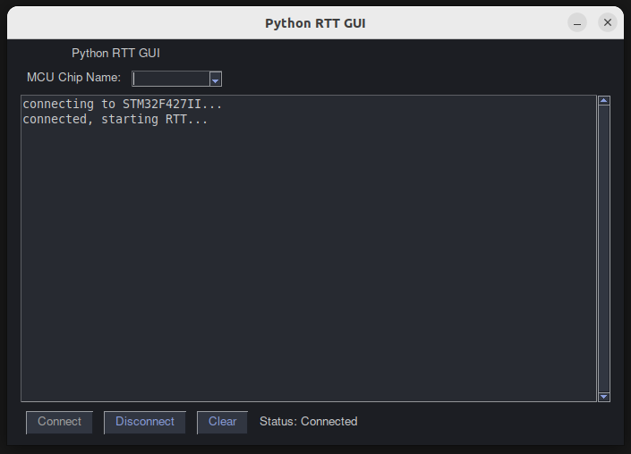

# Python RTT GUI


A Python GUI serving as a wrapper for SEGGER Real-Time Transfer (RTT) debug communication over J-Link.
This project accesses RTT communication directly through the J-Link drivers without the need for intermediary applications.
It can be used as a foundation to create a custom debug communication tool for MCU development, avoiding the use of classical slower and clunky approaches like UART channels. 
Instead, it leverages the J-Link flash debugging adapter for fast debug communication.

## Features
- Connects to MCUs using the J-Link debugger directly via J-Link drivers, eliminating the need for intermediary software such as RTTViewer.
- Displays debug communication live within the GUI.
- Provides log filtering and highlighting functionality.
- Supports most MCUs through a simple filtering and selection interface.
- Includes status monitoring and connection management.

## Prerequisites
- Python 3.8+ (https://www.python.org/)
- J-Link software suite installed (https://www.segger.com/downloads/jlink)
- Required Python packages:
  - PySimpleGUI
  - pylink (Segger's J-Link Python wrapper)

### Use RTTViewer in Embedded Target
- RTT source code is available in the J-Link Software and Documentation Pack under `JLink/Samples/RTT`.
- Include this code in your embedded project and use the `SEGGER_RTT_printf` function to print log messages to the JLink host:
  ```C
  # include SEGGER_RTT.h

  SEGGER_RTT_SetTerminal(0);
  SEGGER_RTT_printf(0, "%s\n", "Hello from embedded MCU");
  ```

## GUI Installation

1. Clone the repository:
   ```bash
   git clone https://github.com/SaturnIC/JLink-RTT-Python-GUI.git
   cd python-rtt-gui
   ```
2. Install the required packages:
   ```bash
   pip install PySimpleGUI pylink

   # or
   pip install -r requirements.txt
   ```
3. Ensure that the J-Link drivers are installed and accessible on your system.

## Usage

1. Run the application:
   ```bash
   python python_rtt_gui.py
   ```

2. Select your target MCU from the dropdown list.

3. Click "Connect" to establish a connection.

4. Use the "Disconnect" button to terminate the connection.

5. Use the "Clear" button to reset the log display.

6. Filter MCUs by typing in the MCU selection field.

## License

This project is licensed under the Apache License, Version 2.0. See [LICENSE](LICENSE) for more details.

## Contact

For questions, issues, or contributions, please contact the maintainer

---

**Note:** Make sure J-Link is properly installed and accessible on your system. The application requires J-Link's Python wrapper (`pylink`) to communicate with the debugger.